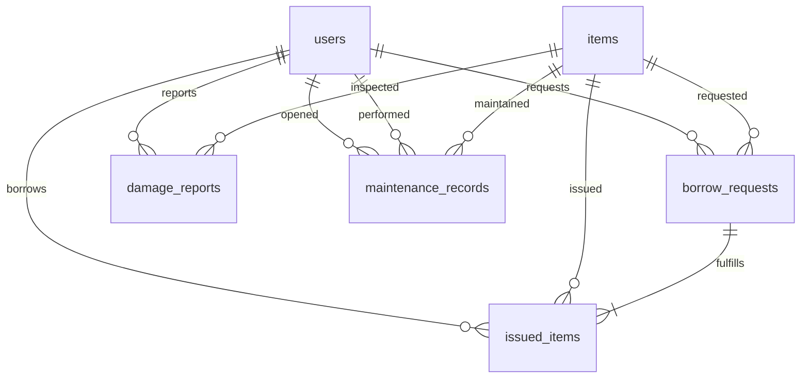

# LabLink Database Schema

This document summarizes the Phase 1 schema provisioned through the Supabase migration `20241128050000_phase1_setup.sql`.

## Entity Relationship Diagram

## Custom Types

| Type | Values | Usage |
|------|--------|-------|
| `user_role` | `admin`, `staff`, `student`, `technician` | Defines access tier for `public.users.role`. |
| `item_status` | `available`, `borrowed`, `maintenance`, `damaged`, `retired` | Tracks current lifecycle of an inventory item and maintenance/damage states. |
| `request_status` | `pending`, `approved`, `rejected`, `issued`, `returned` | Workflow for `public.borrow_requests`. |

## Tables

### `public.users`
Stores profile and authorization metadata for lab members. Each row references a Supabase Auth user via `auth_user_id`.

Key columns:
- `role` (enum) &mdash; determines access policies
- `metadata` (JSONB) &mdash; extensible storage for department, certifications, etc.
- Tracked automatically by `updated_at` trigger and `audit_logs`.

### `public.items`
Inventory catalog with QR hashes for tamper detection.

Highlights:
- `qr_hash` is generated automatically via `public.assign_qr_hash()` which wraps `public.generate_qr_hash()`
- `qr_payload` stores the structured data that is signed into the JWT for offline verification

### `public.borrow_requests`
Represents intent to borrow equipment. Linked to `users` and `items`.

### `public.issued_items`
Records the actual issuance event & return lifecycle. Pointing back to `borrow_requests` allows reconciliations.

### `public.damage_reports`
Captures incident reports, includes optional `photo_path` (points to `maintenance_photos` bucket).

### `public.maintenance_records`
Planned or completed maintenance tasks. `reported_by` vs `performed_by` differentiate reporters vs technicians.

### `public.audit_logs`
Immutable audit table populated by the `audit_log_trigger()` for every tracked table.

Columns:
- `table_name`, `record_id`, `action` (INSERT/UPDATE/DELETE)
- `old_data`, `new_data`
- `changed_by` (UUID derived from JWT claims) and contextual metadata (trigger name, JWT role)

## Helper Functions & Triggers

| Function | Purpose |
|----------|---------|
| `update_updated_at()` | Normalizes `updated_at` values in UTC for all business tables. |
| `audit_log_trigger()` | Captures before/after data and writes to `audit_logs`. Used on users, items, borrow_requests, issued_items, damage_reports, maintenance_records. |
| `generate_qr_hash(item_id, metadata)` | Uses `pgjwt.sign` and `app.settings.qr_secret` (or Supabase JWT secret) to generate tamper-proof QR payloads. |
| `assign_qr_hash()` | BEFORE INSERT trigger on `public.items` that sets `id` if needed, calls `generate_qr_hash`, and seeds `qr_payload`. |

## Realtime Publication

The following tables are subscribed to the default `supabase_realtime` publication so Flutter clients can receive live updates:

- `public.users`
- `public.items`
- `public.borrow_requests`
- `public.issued_items`
- `public.damage_reports`
- `public.maintenance_records`

## Storage Buckets

| Bucket | Visibility | Intended Assets | Notes |
|--------|------------|-----------------|-------|
| `qr_codes` | Public | Downloadable PNG/SVG QR codes | Policies allow public read, authenticated write. |
| `item_images` | Public | Equipment photos | Authenticated uploads; public read for catalogs. |
| `maintenance_photos` | Public | Maintenance proof & damage evidence | Consider migrating to private once auth rules are defined. |
| `chemical_msds` | Public | Safety documents (PDFs) | Enables instant access to SDS sheets. |
| `user_avatars` | Public | Profile avatars | Public read for team directory, uploads restricted to authenticated users. |

All buckets use policies defined in the migration:
- `lablink_public_read_*` &mdash; open read access per bucket
- `lablink_authenticated_write_*` &mdash; restrict uploads to authenticated users
- `lablink_service_delete` &mdash; allows service role cleanup

## Future Considerations

- Add Row Level Security (RLS) policies tailored to each table before exposing data to clients.
- Extend `audit_logs` with IP/device info via `request.jwt.claims` once available from the client.
- Replace public buckets with signed URLs for sensitive content when mobile apps are ready.
